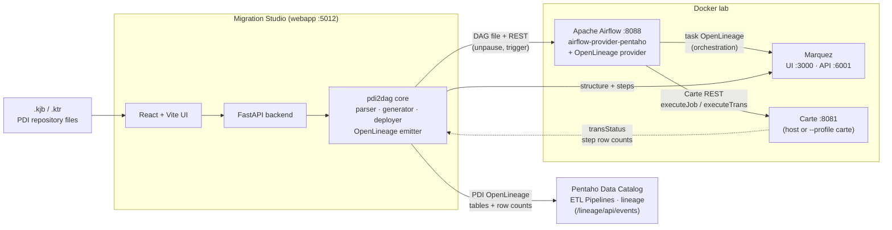
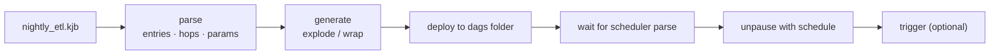

# PDI-AirFlow

Everything for running and migrating **Pentaho Data Integration**
workloads on **Apache Airflow / Astronomer**, with lineage in
**Marquez**.

| Part | What | Where |
|---|---|---|
| Provider | Modernized Airflow provider (Carte + Kitchen/Pan operators, deferrable support) | [airflow-pentaho-provider/](airflow-pentaho-provider/) |
| Workshop | 12-module hands-on workshop: every PDI scheduling scenario on Airflow | [workshop/WORKSHOP.md](workshop/WORKSHOP.md) + [workshop/dags/](workshop/dags/) |
| Lab | Docker stack — **Airflow 3.3** + Marquez. Windows/host: [lab/LAB-SETUP.md](lab/LAB-SETUP.md) · **Ubuntu 24.04 VM**: [lab/UBUNTU-SETUP.md](lab/UBUNTU-SETUP.md) |
| Migration app (CLI) | `pdi2dag` — convert .ktr/.kjb into scheduled Airflow DAGs | [pdi2dag/](pdi2dag/) |
| Migration Studio (web) | React (Vite) + FastAPI app over pdi2dag — PDC-suite design | [webapp/](webapp/) |
| Course companion | Updates for the "How-To: Apache Airflow" self-paced course | [course/COURSE-UPDATE.md](course/COURSE-UPDATE.md) |
| Samples | PDI files used by tests, workshop and demos | [samples/](samples/) |

## Architecture



**Two lineage producers, three destinations:** Airflow's OpenLineage
provider emits *task-level* orchestration lineage to Marquez; the
pdi2dag emitter reads the PDI files (+ optional Carte `transStatus` row
counts) and emits *table-level* lineage to **PDC** and Marquez. The
paid PDI OpenLineage plugin (runtime, column-level) is the third,
product path — see [course/COURSE-UPDATE.md](course/COURSE-UPDATE.md).

## Port map (this machine)

| Port | Service |
|---|---|
| 8080 | Pentaho Server Tomcat (existing — untouched) |
| 8081 | Carte (host install **or** `--profile carte` container) |
| 8088 | Airflow UI (admin/admin) |
| 3000 | Marquez UI |
| 6001 / 6002 | Marquez API / admin (5000-5002 = PDC apps; 6000 = Chrome-unsafe) |
| 5012 | Migration Studio (5010 Glossary dev, 5011 PDC-Policy) |

## Quick start

1. **Lab up** — follow [lab/LAB-SETUP.md](lab/LAB-SETUP.md):
   PDI + Carte on the host, then
   `cd lab/docker && docker compose up -d` for Airflow (:8088,
   admin/admin) and Marquez (:3000).
2. **Workshop** — work through
   [workshop/WORKSHOP.md](workshop/WORKSHOP.md).
3. **Migrate something**:

   ```powershell
   py -3.10 -m venv .venv
   .\.venv\Scripts\pip install -e .
   .\.venv\Scripts\pdi2dag inspect samples\nightly_etl.kjb
   .\.venv\Scripts\pdi2dag migrate samples\nightly_etl.kjb `
       --schedule "0 6 * * *" --param "date={{ ds }}" `
       --dags-folder workshop\dags `
       --airflow-url http://localhost:8088 `
       --airflow-user admin --airflow-password admin --trigger
   ```

## Migration Studio (web app)

React (Vite) + FastAPI, following the PDC suite conventions (same
stylesheet, themes, `.card` shell and `{"error"}` API contract as
PDC-Glossary/PDC-Policy). Load → Configure → Preview → Deploy stepper,
plus a Lineage page backed by the Marquez API.

**One-command launch** (creates a venv, installs deps, builds the UI,
serves everything at http://localhost:5012):

```powershell
.\run.ps1               # or ./run.sh on Linux/macOS
.\run.ps1 -Dev          # hot-reload: Vite :5173 + backend :5012
.\run.ps1 -Port 5555    # different port;  -NoBuild to skip the rebuild
```

Manual equivalent:

```powershell
.\.venv\Scripts\pip install -e .[webapp]
cd webapp\frontend; npm install; npm run build; cd ..\backend
..\..\.venv\Scripts\python -m uvicorn main:app --port 5012
```

## pdi2dag in 30 seconds



`pdi2dag` parses a PDI file and generates a DAG:

- **Transformations (.ktr)** → a DAG with one `CarteTransOperator`.
- **Jobs (.kjb)** → *explode* mode (default): every TRANS/JOB entry
  becomes a task, hops become dependencies, control entries
  (Start/Dummy/Success) are collapsed, failure hops map to
  `trigger_rule='one_failed'`. Or `--mode wrap` to run the job as a
  single Carte task.
- PDI **named parameters** become the `PDI_PARAMS` dict; override or
  template them with `--param "date={{ ds }}"`.
- Anything without an Airflow equivalent (MAIL, SHELL entries...)
  is reported as a migration warning in the generated file's
  docstring and on stdout.
- `migrate` deploys to a dags folder and (optionally) unpauses +
  triggers the DAG through the Airflow REST API.

Commands: `inspect`, `convert`, `migrate`, `deploy`, `lineage` — run
`pdi2dag <cmd> --help`.

## PDI structure in Marquez

Airflow's OpenLineage provider only sees Airflow tasks; the inside of
a PDI job is a black box to it. `pdi2dag lineage` opens it up by
publishing the PDI structure itself as OpenLineage jobs — entries
connected by hop-derived datasets, and (with `--ktr-dir`) every
transformation's step graph:

```powershell
pdi2dag lineage samples\nightly_etl.kjb `
    --ktr-dir lab\docker\carte\repository\home\bi `
    --marquez-url http://localhost:6001 --namespace pdi
```

Marquez then shows three layers in one namespace: the Airflow DAG
runs (from the OpenLineage provider), the PDI job graph
(`nightly_etl.Extract_Sales → Load_Warehouse → Publish_Reports`), and
the steps inside each transformation
(`extract_sales.Get_Variables → Write_to_log`).

## Development

```powershell
.\.venv\Scripts\pip install -e .[dev]
.\.venv\Scripts\python -m pytest        # pdi2dag tests
```

The provider has its own test suite: see
[airflow-pentaho-provider/README.md](airflow-pentaho-provider/README.md).

## License

Apache 2.0. The provider contains code derived from
[airflow-pentaho-plugin](https://github.com/damavis/airflow-pentaho-plugin)
(Copyright 2020 Aneior Studio, SL).
