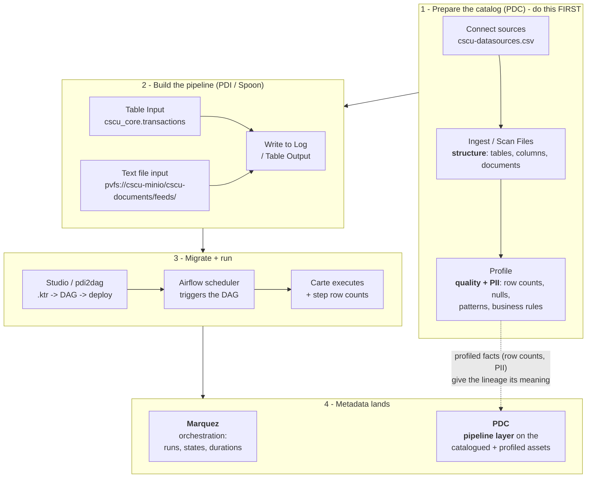

# Capstone - Copper State Credit Union on Airflow

The capstone ties the whole toolkit together on a realistic **Copper
State Credit Union (CSCU)** banking pipeline, following the real
migration workflow: **build the pipeline in PDI (Spoon) -> migrate it in
the Studio -> run it on Carte (single and clustered) under the Airflow
scheduler -> trace the lineage in Marquez and Pentaho Data Catalog.**

It reuses the **same `cscu_core` database** as the PDC-Scenarios /
Glossary lab (`192.168.1.200:5433`), so the PDI table lineage lands in
the **same PDC** the catalog work already uses.

## The process end to end

Order matters: the catalog is prepared **first**, so the PDI metadata
enriches governed assets instead of inventing stubs.



**Three layers on one asset:** *structure* (what it is) from the scan,
*profile* (what the data looks like, how sensitive) from profiling, and
the *pipeline* layer (what consumes it, where it goes, how many rows)
from PDI. Only the third comes from us - and it needs the first two to
land on.

## Two kinds of `.ktr` here

- **Shipped blueprints** — `samples/cscu/*.ktr` (also staged at
  `/CSCU/` in the Carte repository). These are **minimal
  migration-input examples**: just the connection, SQL and target, enough
  for `pdi2dag` to convert them and emit **structural lineage**. They do
  **not** render in Spoon and are **not executable** on Carte - they show
  the *shape* of the pipeline, not a runnable one.

  | Blueprint | Shape |
  |---|---|
  | `extract_transactions.ktr` | `cscu_core.transactions` -> `staging.txn_stg` |
  | `build_member_mart.ktr` | members x branches x accounts x transactions -> `mart.member_360` |
  | `import_ach_csv.ktr` | ACH CSV (local) -> `staging.ach_stg` |
  | `import_ach_minio.ktr` | ACH from MinIO `pvfs://cscu-minio/cscu-documents` -> `staging.ach_stg` |
  | `cscu_daily_load.kjb` | `extract_transactions` -> `build_member_mart` |

- **What you run live** — a transformation **you build in Spoon** (below).
  Spoon writes a complete, executable `.ktr`; that's what actually runs on
  Carte and what a real migration starts from.

Generated reference DAGs live in [`workshop/dags/CSCU/`](../dags/CSCU/).

## Prerequisites

1. **Lab up**: Airflow (`:8088`) + Marquez (`:3000`/`:6001`) on the VM,
   PDC at `https://pentaho.io`, scheduler on the fixed compose
   (`execution_api_server_url`, v1.15.5+).
2. **CSCU data** (for live execution): `cd PDC-Scenarios/data_sources/lab
   && make load SCENARIO=CSCU` loads the read-only `cscu_core`.
3. **Carte** from the install (`cd C:\PDI-Airflow ; .\run-carte.ps1`),
   with a **`cscu-core`** database connection to
   `192.168.1.200:5433 / cscu_core / pdc_user / catalog123!` defined as a
   **shared** connection in Spoon (so every transformation resolves it).

   > Spoon saves shared connections to your **global**
   > `%USERPROFILE%\.kettle\shared.xml`, but the launcher sets
   > `KETTLE_HOME` to the install - so `run-carte.ps1` **syncs
   > `shared.xml`** into `C:\PDI-Airflow\.kettle\` on startup. Without it
   > the step fails `!BaseDatabaseStep.Init.ConnectionMissing!` even
   > though the connection tests fine in Spoon. Define the connection in
   > Spoon *first*, then start Carte.
4. **Catalog the CSCU sources in PDC first** - connect -> ingest ->
   **profile**. This is what lets the PDI metadata *enrich* governed
   assets instead of creating stubs, and what gives the lineage meaning.

   a. **Connect** - the kit pre-fills both connections in
      `PDC-Scenarios/data_sources/CSCU/cscu-datasources.csv` (load them
      with the Glossary Generator's bulk loader, or add them by hand):

      | Source | Details |
      |---|---|
      | `CopperState_Core_Banking` (postgres) | `192.168.1.200:5433`, db+schema `cscu_core`, `pdc_user` / `catalog123!` |
      | `CopperState_Documents` (minio) | `http://192.168.1.200:9000`, bucket `cscu-documents`, `cscu_minio_user` / `minio_secret_123!` |

   b. **Ingest / Scan Files** - the *structure* layer (tables, columns,
      types; documents in the bucket).

   c. **Profile** - the *quality + sensitivity* layer: row counts, null
      %, distinct/cardinality, patterns, and the PII hits that drive the
      business rules. This is CSCU courseware **Workshop-04 (Profiling &
      Quality)** and **Workshop-05 (Data Identification)** - the six
      rules, the flagship `opted_out_marketing` opt-out, the PCI
      `cvv_cd` triangulation.

   > Scan the **whole** bucket (`path: /`) - including `feeds/`. The PDI
   > lineage is meant to land *on* those catalogued objects; excluding
   > them would remove the assets the enrichment attaches to. If the
   > sources aren't catalogued first, PDC auto-creates bare stub data
   > sources from the incoming lineage events instead.

   **Why profiling matters to the lineage** (not just housekeeping):
   - **Row counts reconcile** - PDC profiles `cscu_core.transactions` at
     *N* rows; Carte reports it read *N* into `staging.txn_stg`. Those
     two numbers agreeing (or not) is a real data-quality signal.
   - **Sensitivity propagates** - once profiling flags `ssn`, `cvv_cd`,
     `ext_acct_no`, the PDI lineage shows *which pipeline carries those
     columns into a downstream mart*. That is the governance question a
     catalog alone cannot answer.
   - **`opted_out_marketing`** - lineage showing which pipeline moves
     that column downstream is exactly the compliance trace.

   > **Honest limit:** this emitter is **table/dataset-level**. It shows
   > `members -> member_360` with row counts, not "`ssn` lands in column
   > X" - column-level lineage is the paid PDI OpenLineage plugin's
   > territory.

   > **Two things that decide whether lineage renders in PDC:**
   >
   > 1. **Where you look.** PDI lineage builds the **lineage graph** on
   >    the data assets. It is **not** the *ETL hierarchy* - that is a
   >    separate feature, and pipelines will never appear there.
   > 2. **Only certain steps carry lineage.** PDC recognises **Table
   >    input/output, Text file input/output, S3 CSV input, S3 file
   >    output, Microsoft Excel input/writer**. Anything else - notably
   >    **Write to Log** - produces *no dataset*. A transformation that
   >    reads a table and logs it therefore emits an input with **no
   >    output**: half an edge, so the graph has nothing to draw. Give
   >    every pipeline you want to see in PDC a **supported output
   >    step**.

The *migration + structural-lineage* part (Module 1) needs none of the DB
or Carte - it works off the shipped blueprints.

---

## Module 0 - Build the pipeline in PDI (Spoon)

The authentic starting point: author the transformation in Spoon, which
produces a real, executable, migratable `.ktr`.

1. Connect Spoon to the **`Default`** repository (`C:\PDI-Airflow\pipelines`).
2. New transformation. Drag a **Table Input** (connection `cscu-core`):
   ```sql
   SELECT txn_id, acct_id, txn_dt, post_dt, txn_amt, merch_nm, mcc_cd
   FROM cscu_core.transactions
   WHERE post_dt >= '2026-06-01'
   ```
3. Drag a **Write to Log** (log the fields), then a **Text file output**
   after it, writing to `C:/PDI-Airflow/output/txn_report` (extension
   `csv`, *Create parent folder* on).

   > The Text file output is what makes the pipeline **visible in PDC's
   > lineage graph**. Write to Log carries no lineage, so without a
   > supported output step the transformation emits an input and no
   > output - half an edge, and PDC draws nothing (while still returning
   > HTTP 200). Chain it *after* Write to Log rather than branching off
   > Table Input: two targets on one step **distribute** the rows
   > between them, so each would get roughly half.

   *(For the full member-360 mart, add a `Table Output` to
   a writable `cscu-mart` target instead.)*
4. Hop Table Input -> Write to Log; **Save as** `/CSCU/txn_report`.

You now have `/CSCU/txn_report` - a genuine transformation that reads real
credit-union data and runs on Carte.

---

## Module 1 - Migrate in the Studio (10 min)

No database or Carte needed - this is the migration itself, run on the
shipped **blueprint** (`cscu_daily_load.kjb` + its two transformations) to
show conversion and structural lineage.

1. Studio -> **Load** -> drop `samples/cscu/cscu_daily_load.kjb`. The
   Studio auto-pulls the two transformations it calls.
2. **Configure**: schedule `0 2 * * *`, pick the **Carte connection**
   `pdi_default` (or `pdi_cluster` for the clustered run later).
3. **Preview** the generated DAG: the job's two `TRANS` entries become
   `CarteTransOperator` tasks wired `Extract_Transactions >>
   Build_Member_Mart`; the `MAIL` entry surfaces as a migration
   **warning** (no Airflow equivalent - port to an `EmailOperator`).
4. **Deploy** to `deploy-target`. On the VM the scheduler parses it
   within ~30s.

**Lineage without running anything:** Studio -> **Lineage** publishes the
PDI *structure* to PDC - the `cscu_core.transactions -> staging.txn_stg`
and `members/accounts/transactions -> mart.member_360` table lineage,
built from the `.ktr` SQL. Open PDC and follow a member's data from the
core tables into the mart.

## Module 2 - Migrate and run it on a single Carte (15 min)

Now the real thing: migrate the **`txn_report`** you built in Module 0
and run it live.

*(needs `cscu_core` loaded + Carte running + `/CSCU/txn_report`)*

1. **Migrate** it: Studio -> **Load** ->
   `C:\PDI-Airflow\pipelines\CSCU\txn_report.ktr` -> **Configure**
   (`pdi_default`) -> **Deploy**. (Or `pdi2dag migrate
   ...\txn_report.ktr --dags-folder ...\deploy-target ...`.)
2. **Carte**: `cd C:\PDI-Airflow ; .\run-carte.ps1` (serves `/CSCU/*`).
3. **Trigger** the `txn_report` DAG. It runs on Carte, reads
   `cscu_core.transactions`, and streams the rows into the Airflow task
   log; the input lineage `cscu_core.cscu_core.transactions` shows in
   Marquez/PDC.

> **The full mart pipeline** (`cscu_daily_load`: extract -> member-360
> mart) is the advanced version - build both transformations in Spoon
> with a `Table Output` to a **writable `cscu-mart`** database (the
> PDC-Scenarios `cscu_core` is read-only), then migrate the `.kjb`.

## Module 3 - Run clustered (20 min)

Contrast single-server with a **Carte cluster**.

1. Stop the single Carte; start the cluster: `.\run-carte-cluster.ps1`
   (master `:8081` + slaves `:8082`/`:8083`). Confirm registration at
   `http://localhost:8081/kettle/getSlaves/`.
2. In the Studio's **Configure** page, set the **Carte connection** to
   `pdi_cluster` (seeded in Airflow, pointing at the master) and
   redeploy - or `pdi2dag convert build_member_mart.ktr --conn-id
   pdi_cluster`.
3. Assign a **cluster schema** to `build_member_mart` in Spoon (the
   member-360 aggregation is the step that benefits) so the master fans
   the work across the slaves.
4. Trigger and watch: the same DAG, now executing clustered. Airflow
   orchestration is identical - only the Carte run configuration changed.

## Module 4 - Full lineage (15 min)

1. **Marquez** (`:3000`, namespace `pdi`): the `cscu_daily_load` job with
   `Extract_Transactions` / `Build_Member_Mart` runs, states and
   durations - the *orchestration* view.
2. **PDC**: the *table* lineage - `cscu_core.members`,
   `cscu_core.accounts`, `cscu_core.transactions` feeding
   `cscu_mart.mart.member_360`, with real row counts when Carte metrics
   are attached (`pdi2dag lineage ... --carte-status`). This is the same
   PDC that catalogs the CSCU sources in the Glossary scenario, so the
   PDI pipelines slot straight into the existing catalog.

**Division of responsibility:** Carte owns runtime row metrics, Airflow
owns orchestration/retries/schedule, Marquez owns run history, PDC owns
the governed table lineage. The capstone shows all four working on one
credit-union pipeline.

## Module 5 - Object-store ingestion from MinIO (15 min)

The same `cscu-documents` MinIO bucket that PDC/Glossary catalogs for
*unstructured* documents can also be a PDI **source** - so the pipeline
and the document catalog share one bucket.

Keep PDI feeds in their own prefix, **`feeds/`**, so they don't mix with
the documents PDC scans. Upload the sample feed
[`samples/cscu/data/ach_payments_2026.csv`](../../samples/cscu/data/ach_payments_2026.csv)
to `cscu-documents/feeds/` (MinIO console `:9001`, or
`mc cp ach_payments_2026.csv local/cscu-documents/feeds/`).

1. **Create a VFS connection** in Spoon (New VFS Connection ->
   Amazon S3/Minio/HCP -> S3 Connection Type `Minio/HCP`):

   | Field | Value |
   |---|---|
   | Connection Name | `cscu-minio` |
   | Access Key | `cscu_minio_user` |
   | Secret Key | `minio_secret_123!` |
   | Endpoint | `http://192.168.1.200:9000` |
   | **Signature Version** | **`AWSS3V4SignerType`** |
   | PathStyle Access | ✅ (MinIO requires path-style) |
   | Default S3 Connection | ✅ (so plain `s3://…` URLs route through this endpoint) |
   | Root Folder Path | `/` |

   > **Gotcha 1:** the Signature Version field wants the AWS SDK **signer
   > type** `AWSS3V4SignerType` - **not** the algorithm string
   > `AWS4-HMAC-SHA256`, which fails with
   > `IllegalArgumentException: unknown signer type`.

   > **Gotcha 2 - address the connection explicitly.** *Default S3
   > Connection* makes a plain `s3://cscu-documents/…` URL work **in
   > Spoon**, but it does **not** route through the named connection on
   > **Carte** - the path resolves to nothing. Use the explicit,
   > connection-scoped form instead:
   >
   > ```
   > pvfs://cscu-minio/cscu-documents/feeds/
   > ```
   >
   > `pvfs://<connection-name>/<bucket>/<path>` names the connection in
   > the URL, so it behaves the same in Spoon and on the server. This is
   > the form the shipped `ingest_from_minio.ktr` uses.

2. **Build it in Spoon** (as in Module 0) - `/CSCU/ingest_from_minio`:

   - **Text file input** reads a **whole folder**: set *File/Directory* to
     `pvfs://cscu-minio/cscu-documents/feeds/` and *Wildcard (RegExp)*
     to `.*\.csv`, then **Add**. Every matching object is picked up - you do **not**
     enter files one by one, and tomorrow's drop is included automatically.
     (**CSV file input** is single-file and faster; use it when you want
     exactly one object, or feed it filenames from a **Get File Names**
     step.)
   - On the **Content** tab set *Format* to **mixed**. `DOS` hard-fails
     on Unix line endings with *"DOS format was specified but only a
     single line feed character was found"*; `mixed` accepts either.
   - Leave *File required* **checked**. Unchecked, an unresolvable path
     matches zero files and the transformation reports **Finished with 0
     rows and no error** - a green run that did nothing.
   - **Get Fields** to read the header (`ach_id, acct_id, ach_rte_no,
     ext_acct_no, dir_cd, ach_amt, eff_dt, ach_status, return_cd`).
   - **Write to Log** (or `Table Output` to a writable `cscu-mart`), hop,
     **Save as** `/CSCU/ingest_from_minio`.

3. **Migrate and run** it as in Module 2, on single Carte or clustered.
4. **Lineage**: the input dataset is
   `s3://cscu-documents` + `feeds/ach_payments_2026.csv` (object-store
   scheme + bucket kept as the namespace). In Marquez/PDC the PDI job now
   traces from the **MinIO object** into the mart - the object-store half
   of the catalog, produced by PDI rather than a document scan.

**This is the enhanced-metadata story.** Leave the feed *in* the scanned
bucket - the overlap is the whole point. The same object ends up carrying
two layers:

| Layer | Source | What it tells you |
|---|---|---|
| Catalogued asset | PDC scan of `cscu-documents` | *what the object is* - structure, classification, PII |
| **Pipeline lineage** | **PDI (this module)** | *what consumes it and where the data goes* - `feeds/ach_payments_2026.csv` -> `staging.ach_stg`, with Carte row counts |

PDC cannot derive that second layer by scanning; PDI supplies it. The
same holds on the DB side: PDC catalogs the `cscu_core` tables, and PDI
lineage adds the **flow between them**. That is what "enhanced PDI
metadata" means here - the pipeline dimension layered onto governed
assets, not a parallel catalog.

---

*All Copper State Credit Union data is fictional and generated for
training.*
