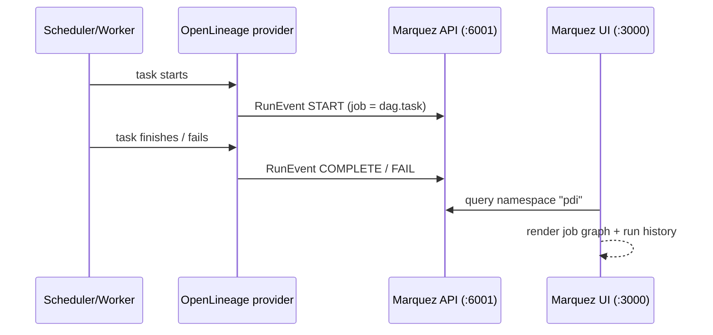

# Workshop — Scheduling Pentaho Data Integration with Apache Airflow

Hands-on workshop covering every scheduling scenario for PDI on
Airflow, from a first Carte run to lineage in Marquez. Each module has
a ready-made DAG in [dags/](dags/) — the module text tells you what to
run, what to observe, and why it matters.

**Prerequisite**: the lab from [../lab/LAB-SETUP.md](../lab/LAB-SETUP.md)
is up (Carte on the host, Airflow on :8088, Marquez on :3000).

Duration: ~4 hours. Modules 1–5 are the core; 6–12 can be split into a
second session.

---

## Module 0 — Orientation (10 min)

Two execution models exist for PDI on Airflow, and the workshop uses
both:

| Model | Operators | Where PDI runs | When to use |
|---|---|---|---|
| **Remote (Carte)** | `CarteJobOperator`, `CarteTransOperator` | On a Carte server, via REST | Default. Workers stay thin; scale Carte independently. |
| **Local (Kettle)** | `KitchenOperator`, `PanOperator` | On the Airflow worker itself | When workers have PDI installed; file-based ETL without a repository. |

Open the Airflow UI (http://localhost:8088) and confirm the workshop
DAGs are listed. Everything you do in this workshop is: *PDI does the
data work, Airflow does the scheduling, dependencies, retries and
observability.*

## Module 1 — Your first Carte task (15 min)

DAG: [dags/01_carte_trans_basic.py](dags/01_carte_trans_basic.py)

1. Unpause `m01_carte_trans_basic` and press ▶ (Trigger).
2. Open the task log. You'll see the Carte submission
   (`Job started`/id), then the PDI log streamed into the Airflow log
   — the operator polls `transStatus` every 5 s and appends new log
   lines until a terminal status.
3. Open `http://localhost:8081/kettle/status/` — the same execution is
   visible on the Carte side.

**What to note**: `trans='/home/bi/hello_world'` is a *repository*
path. The connection (`pdi_default`) carries everything else: host,
port, repo name, Carte credentials.

## Module 2 — Scheduling a Carte job (15 min)

DAG: [dags/02_carte_job_scheduled.py](dags/02_carte_job_scheduled.py)

1. Read the DAG: `schedule='30 6 * * *'`, `catchup=False`, retries
   with delay.
2. Unpause it. It will wait for 06:30 — trigger it manually once to
   see a run.
3. In the Airflow UI, check the **Next Run** column, and hover the
   schedule to see the cron interpretation.

**Scheduling vocabulary** (this replaces PDI's Start-entry scheduler
and Windows Task Scheduler/cron around Kitchen):

- `schedule='30 6 * * *'` — cron. Also accepts presets
  (`'@daily'`, `'@hourly'`), `timedelta(hours=4)`, cron with timezone
  (DAG `start_date=pendulum.datetime(..., tz='Europe/Dublin')`).
- `catchup` — whether Airflow backfills intervals missed while the
  DAG was paused. PDI has no equivalent; this is a superpower — try
  `airflow dags backfill` later.
- A DAG run for interval *X* starts **after** *X* ends: the run
  labelled `2026-07-17` executes on `2026-07-18 06:30` with
  `{{ ds }} = 2026-07-17`.

## Module 3 — Schedule variants (10 min)

No new DAG — edit `m02`:

1. Change the schedule to `timedelta(hours=2)` → save → observe Next
   Run.
2. Change it to `'@daily'`.
3. Revert to the cron. Each is valid; pick per pipeline. (Datasets in
   module 9 replace cron entirely.)

## Module 4 — Parameters & templating (20 min)

DAG: [dags/04_params_templating.py](dags/04_params_templating.py)

PDI *named parameters* map 1:1 to the operator's `params` dict, and
Airflow renders Jinja templates in it first:

1. Trigger `m04_params_templating` with **Trigger DAG w/ config** and
   set `{"region": "APAC"}`.
2. In the task log, find the PDI log line printing the received
   `date`, `window_start`, `region` values.
3. Cross-check in Spoon: the transformation's parameters (Settings →
   Parameters) are exactly what Airflow supplies.

Template toolbox: `{{ ds }}` (interval date), `{{ data_interval_start
}}` / `{{ data_interval_end }}`, `{{ params.x }}` (UI-supplied),
`{{ var.value.get('key') }}` (Airflow Variables), `{{ ti.xcom_pull(...)
}}` (upstream results).

## Module 5 — Multi-transformation pipelines (25 min)

DAG: [dags/05_pipeline_dependencies.py](dags/05_pipeline_dependencies.py)

This is the PDI-job-as-DAG pattern: what you'd draw as hops in a .kjb
becomes explicit, observable task dependencies.

1. Trigger `m05_pipeline_dependencies` and watch the **Graph** view:
   the two extracts run in parallel, `load_warehouse` waits for both.
2. `alert_on_failure` has `trigger_rule='one_failed'` — the Airflow
   equivalent of a PDI failure hop. It shows as *skipped* on a clean
   run.
3. Break it on purpose: edit the DAG to reference a non-existent
   transformation, trigger, and watch the failure path fire and the
   retries happen per-task (not per-job, like PDI would).

**Why explode a PDI job into tasks?** Per-entry retries, per-entry
logs, parallelism managed by Airflow pools, partial re-runs (Clear a
single task), and per-entry lineage in Marquez.

## Module 6 — Local execution: Kitchen & Pan (15 min)

DAG: [dags/06_kitchen_pan_local.py](dags/06_kitchen_pan_local.py)
(read-through if your workers have no PDI installed)

- `PanOperator`/`KitchenOperator` build a `pan.sh`/`kitchen.sh`
  command from the same `pdi_default` connection (`pentaho_home`
  extra) and stream stdout to the task log.
- `file='/opt/etl/local_job.kjb'` runs file-based, repository-less
  (`-norep`).
- Production pattern: dedicate workers with PDI installed and route
  via `queue='pdi'` (`airflow celery worker -q pdi`).

## Module 7 — Deferrable mode (20 min)

DAG: [dags/07_deferrable_carte.py](dags/07_deferrable_carte.py)

1. Trigger `m07_deferrable_carte` (uses the `long_running_job` with a
   Wait step).
2. Browse → Task Instances: the state is **deferred** (purple), not
   running — no worker slot is held. The triggerer polls Carte every
   15 s.
3. Compare: trigger `m02` (non-deferrable) at the same time and see
   its slot occupied in **Admin → Pools**.

On Astronomer this is the difference between paying for idle workers
and not — always set `deferrable=True` for long Carte executions.

## Module 8 — Failure handling (20 min)

DAG: [dags/08_failure_handling.py](dags/08_failure_handling.py)

Covers the full failure toolkit around a Carte load:

- **Retries** with exponential backoff (`default_args`).
- **`execution_timeout`** — Airflow kills the task after 30 min, and
  the operator's `on_kill` calls Carte `stopTrans`, so the remote
  transformation stops too. Verify by killing a running task manually
  (Mark Failed) and watching the Carte status page.
- **err_count XCom**: PDI can finish "successfully" while logging
  errors. The branch task routes to `notify_data_team` whenever
  `err_count > 0`. Check XCom values under the task's XCom tab.
- **Callbacks**: `on_failure_callback` for alerting (swap the print
  for Slack/email in production).

## Module 9 — Data-aware scheduling (Datasets) (20 min)

DAG: [dags/09_dataset_scheduling.py](dags/09_dataset_scheduling.py)

1. `m09a_dataset_producer` declares
   `outlets=[Dataset('warehouse://staging/sales')]` on the staging
   transformation.
2. `m09b_dataset_consumer` has `schedule=[SALES_STAGING]` — no cron.
3. Trigger the producer; when it succeeds, the consumer starts by
   itself. See **Browse → Datasets** for the dependency graph.

This decouples pipelines the way PDI never could: downstream teams
subscribe to *data being ready*, not to a time of day.

## Module 10 — Dynamic task mapping (15 min)

DAG: [dags/10_dynamic_mapping.py](dags/10_dynamic_mapping.py)

`list_partitions()` returns one dict per region at runtime and
`CarteTransOperator.partial(...).expand(params=...)` creates one Carte
run per element — the Airflow-native replacement for PDI's "Execute
for every input row" looping. Trigger it and open the mapped task's
[] index view.

## Module 11 — Migrating a PDI job with pdi2dag (30 min)

Uses the migration app in this repo (see the root README).

1. Inspect the sample job:

   ```powershell
   pdi2dag inspect samples\nightly_etl.kjb
   ```

   Note the entries, the hops, and the failure hop to `Mail Failure`.

2. Convert without deploying and read the generated code:

   ```powershell
   pdi2dag convert samples\nightly_etl.kjb --schedule "0 6 * * *" --param "date={{ ds }}"
   ```

   Observe: entries → operators, hops → `>>` dependencies, PDI
   parameters → `PDI_PARAMS`, the MAIL entry flagged as a migration
   warning in the module docstring.

3. Migrate for real — deploy into the lab's dags folder, unpause and
   trigger via the REST API:

   ```powershell
   pdi2dag migrate samples\nightly_etl.kjb --schedule "0 6 * * *" `
       --param "date={{ ds }}" --deferrable `
       --dags-folder workshop\dags `
       --airflow-url http://localhost:8088 `
       --airflow-user admin --airflow-password admin --trigger
   ```

4. Watch `nightly_etl` run in the Graph view. (It needs the
   `/home/bi` content from the lab; expect failures on any repo path
   you didn't create — that's part of reviewing a migration.)

5. Try your own: export any .kjb from your repository and run
   `pdi2dag inspect` / `convert` on it. Review the warnings — they
   are your migration TODO list.

## Module 12 — Lineage in Marquez (20 min)



1. Verify the wiring with the PDI-free DAG: trigger `lineage_demo`,
   then open http://localhost:3000, pick namespace `pdi`, and find
   job `lineage_demo.extract` etc. The graph shows the run history
   and durations.
2. Now trigger `m05_pipeline_dependencies` (or `nightly_etl` from
   module 11). Every task appears as a Marquez job with run states —
   your PDI pipeline is now observable in a lineage tool.
3. API check:
   `curl http://localhost:6001/api/v1/namespaces/pdi/jobs | jq '.jobs[].name'`.

**Going deeper — PDI steps in Marquez.** The OpenLineage provider only
sees Airflow tasks; to see *inside* the PDI job, publish its structure
with the emitter:

```powershell
pdi2dag lineage samples\nightly_etl.kjb `
    --ktr-dir lab\docker\carte\repository\home\bi `
    --marquez-url http://localhost:6001 --namespace pdi
```

Refresh Marquez: the namespace now also contains the PDI job graph
(entries linked by hop-derived `pdi://` datasets) and, for every
transformation whose .ktr was found, the step graph
(`extract_sales.Get_Variables → Write_to_log`). Open any of these jobs
in Marquez and switch to the graph tab to see the fan-in
Extract_Sales + Extract_Customers → Load_Warehouse → Publish_Reports —
the same picture as the Spoon canvas.

**Division of responsibility** (deliberate — don't blur it): Carte owns
runtime step metrics (rows read/written, live on its status page and
streamed into the Airflow task log by the operators); Airflow owns
orchestration state; Marquez owns *structure only* — no row counts in
the lineage graph. If a catalog ever needs volumes, the disciplined
slot is OpenLineage's `outputStatistics` facet (a single rowCount on
the result *dataset*), never per-step job noise. The
`outlets=[Dataset(...)]` pattern from module 9 remains the manual
bridge for real table-level datasets.

---

## Wrap-up — scenario cheat sheet

| Scenario | Tool |
|---|---|
| Run trans/job on Carte, cron schedule | `CarteTransOperator`/`CarteJobOperator` + `schedule` |
| Long-running Carte work without blocking workers | `deferrable=True` |
| PDI on the worker, file-based | `PanOperator`/`KitchenOperator` (+ `queue`) |
| Pass dates/config into PDI | `params` + Jinja (`{{ ds }}`, `{{ params.x }}`) |
| PDI job graph with per-entry control | Explode via `pdi2dag` (hops → dependencies) |
| Failure branch / alerting | `trigger_rule`, callbacks, `err_count` XCom |
| Trigger when data is ready | Datasets (`outlets` / `schedule=[ds]`) |
| One run per file/region/tenant | Dynamic task mapping (`.expand`) |
| Backfill history | `catchup` / `airflow dags backfill` |
| Migrate existing .kjb/.ktr | `pdi2dag migrate` |
| See it all as lineage | OpenLineage → Marquez |
